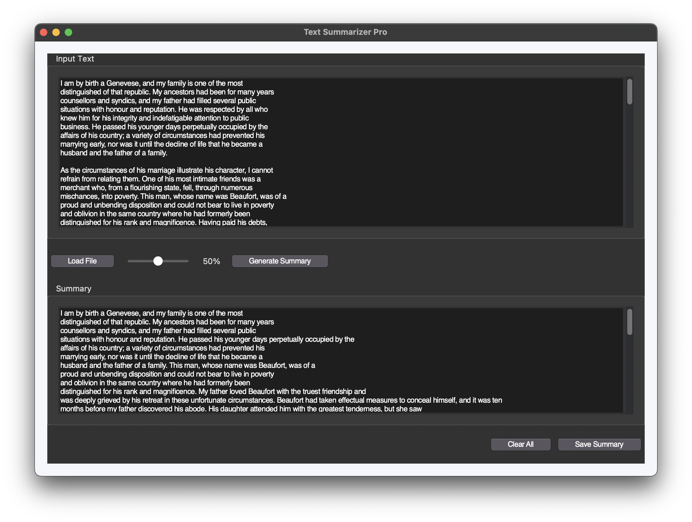

# Text Summarizer Pro

A GUI-based application for generating text summaries using TF-IDF and cosine similarity.



## Features
- Load text files (.txt)
- Adjustable summary length (10%-90% of original)
- Save generated summaries
- Clean modern interface
- Cross-platform support (Windows & macOS)

## Installation

1. **Prerequisites**:
   - Python 3.8+
   - pip package manager

2. **Install dependencies**:
   ```bash
   pip install -r requirements.txt
   ```

3. **Download NLTK data** (first run only):
   ```bash
   python -m nltk.downloader punkt stopwords
   ```

## Usage
```bash
python main.py
```

- Click "Load File" to import a text file
- Use the slider to select summary length
- Click "Generate Summary" to create summary
- Use "Save Summary" to export results
- "Clear All" resets the interface

## Project Structure
```
text-summarizer/
├── main.py
├── requirements.txt
├── README.md
└── app/
    ├── __init__.py
    ├── gui.py
    ├── summarizer.py
    └── utils.py
```

## License
MIT License